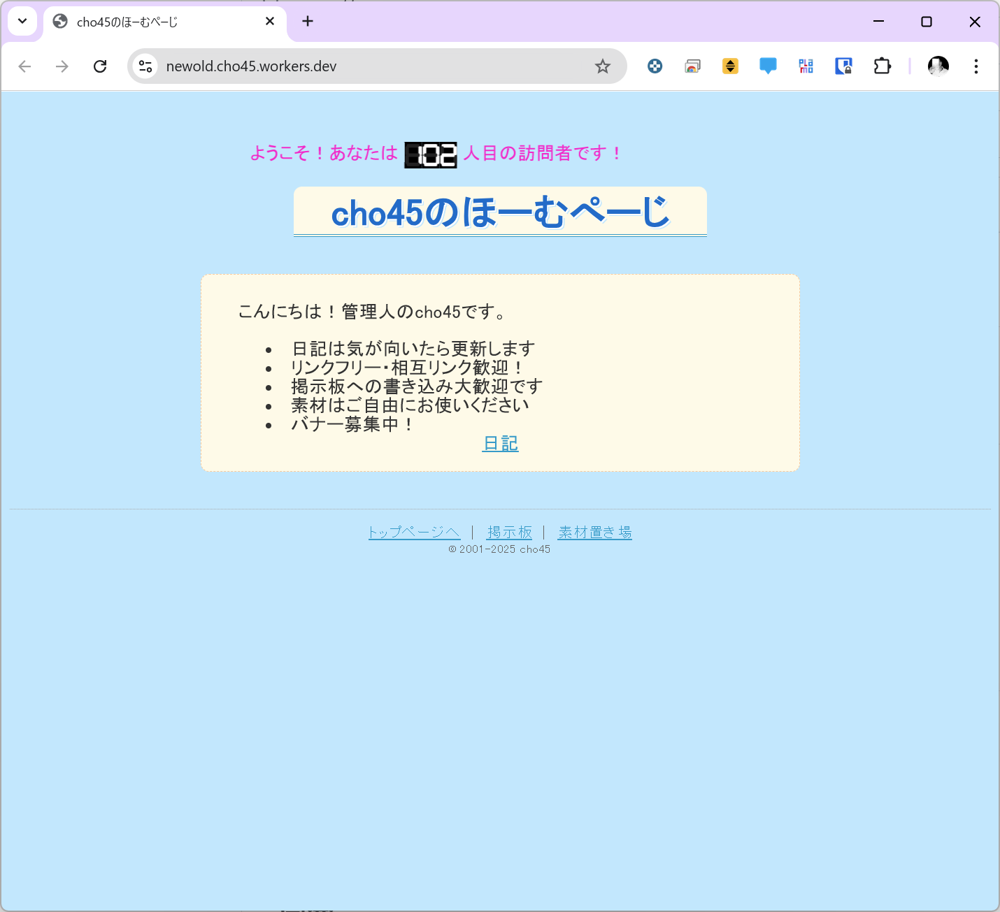
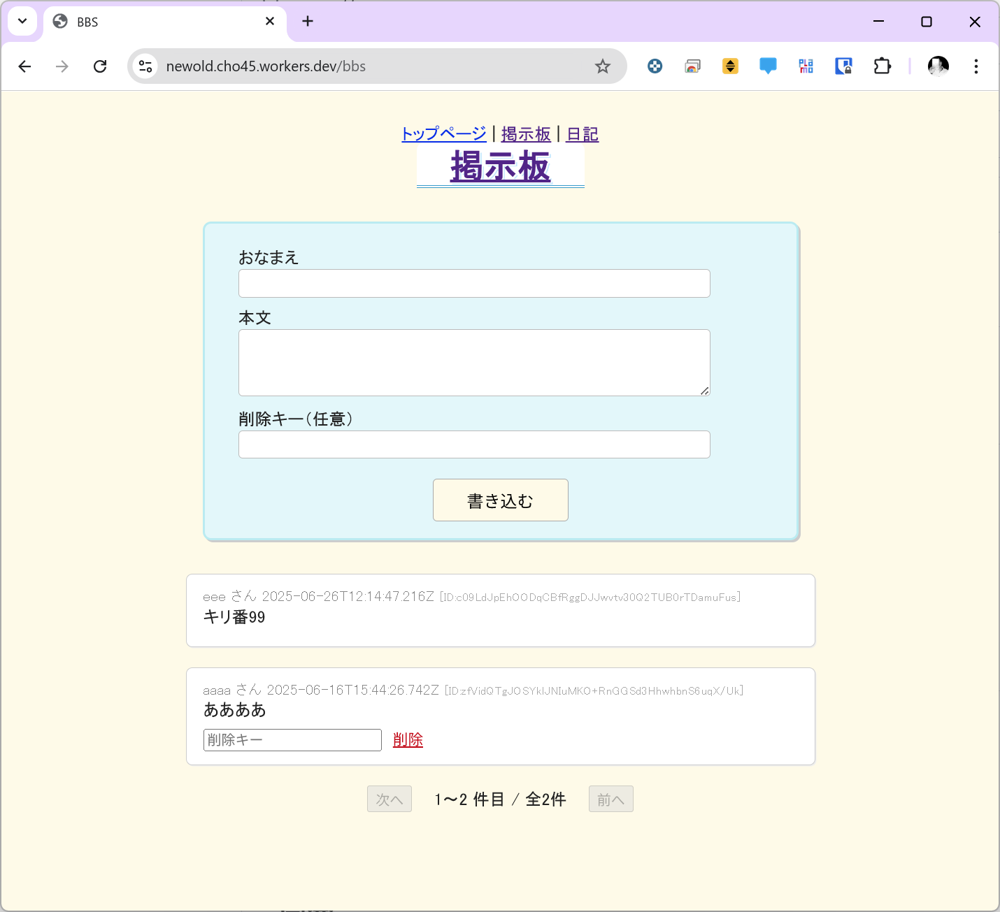
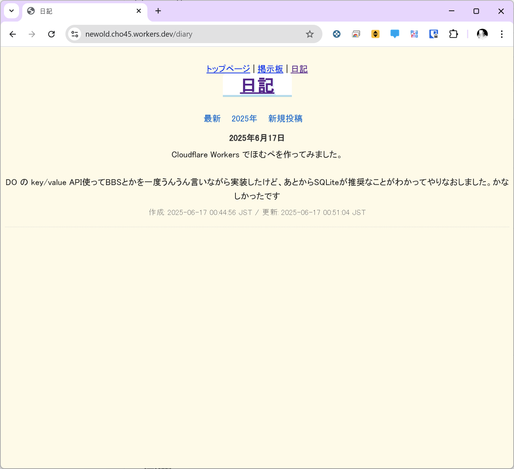

# CF-Neocities



HonoフレームワークとCloudflare Workersを使用したウェブアプリケーションです。

## 機能

- **Counter**: キリ番検出機能付きグローバル訪問カウンター
- **BBS**: ページネーション機能付き掲示板システム
- **Diary**: Basic認証付き日記システム
- **テンプレートシステム**: ビルド時コンパイル付きHTMLテンプレート
- **静的アセット**: カウンター表示用SVG数字レンダリング

### 画面イメージ

| BBS | Diary |
| --- | --- |
|  |  |

## 技術スタック

- [Hono](https://hono.dev/) - 軽量ウェブフレームワーク
- [Cloudflare Workers](https://workers.cloudflare.com/) - サーバーレスプラットフォーム
- [Durable Objects](https://developers.cloudflare.com/durable-objects/) - 永続化ストレージ
- SQLite - データベース
- TypeScript - 型安全性

## 開発

### 前提条件

- Node.js 18+
- Cloudflare Workers アカウント

### セットアップ

```bash
npm install
```

### 開発サーバー

```bash
npm run dev
```

### デプロイ

```bash
npm run deploy
```

### その他のコマンド

```bash
# バンドルサイズレポート
npm run size

# 型定義生成
npm run cf-typegen

# テンプレートビルド
npm run build:templates

# テスト実行
npm run test
```

## 環境変数の設定

### 日記機能の Basic 認証

日記機能の管理画面にアクセスするためのBasic認証の設定:

```bash
# ユーザー名を設定
npx wrangler secret put DIARY_AUTH_USERNAME

# パスワードを設定
npx wrangler secret put DIARY_AUTH_PASSWORD
```

設定しない場合はデフォルト値（username: admin, password: password）が使用されます。

## 型生成

[Worker設定に基づいて型を生成/同期する場合](https://developers.cloudflare.com/workers/wrangler/commands/#types):

```bash
npm run cf-typegen
```

Honoインスタンス化時に`CloudflareBindings`をジェネリクスとして渡す:

```ts
// src/index.ts
const app = new Hono<{ Bindings: CloudflareBindings }>()
```

## アーキテクチャ

### Durable Objects

- **Counter**: アトミックなインクリメント操作
- **BBS**: 論理削除とIP追跡機能付き掲示板
- **Diary**: Basic認証で保護された日記システム

### セキュリティ

- CSRF保護（`x-requested-with`ヘッダー）
- SQLインジェクション対策（パラメータ化クエリ）
- IPアドレスハッシュ化（プライバシー保護）
- Basic認証（日記機能）

## 運用コスト見積もり（2025年6月時点）

**Cloudflare Workers（無料プラン）**
- 1日10万リクエストまで無料
- 上限超過時は HTTP 429 エラー
- 有料プラン：$5/月（1,000万リクエストまで）

**Durable Objects**
- 1,000,000リクエスト/月まで無料
- 超過分：$0.15/100万リクエスト
- ストレージ：1GBまで無料、以降$0.20/GB/月

**その他**
- R2（オブジェクトストレージ）：1GBまで無料
- ドメイン：Cloudflareで.comなら$8.57/年
- 静的ファイル配信：追加コストなし

**まとめ**
- 個人・趣味サイト規模（1日3万アクセス未満）なら月額0円＋年額ドメイン代で運用可能
- 1日3万アクセスを超える場合や、DOストレージが1GBを超える場合のみ追加コスト

### ストレージ容量の目安

- Durable Objects（DO）の無料ストレージ枠は1GB
- 掲示板1投稿あたりの消費容量は約1KB
- 理論上は約100万投稿分を保存可能
- 例：1日100投稿の場合、1GB上限に達するには約27年

## ライセンス

MIT License
